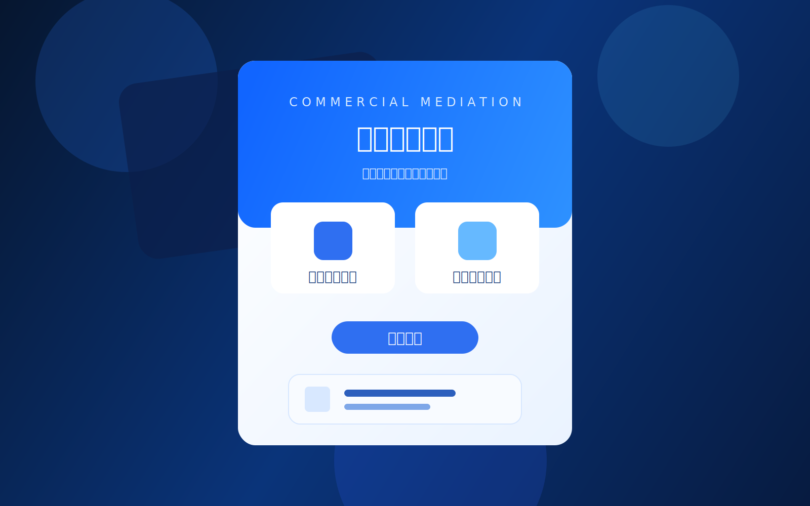
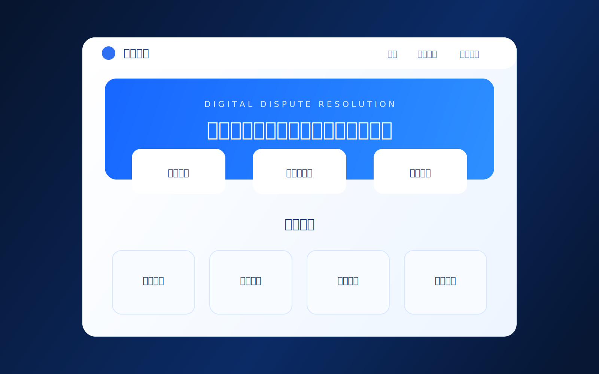
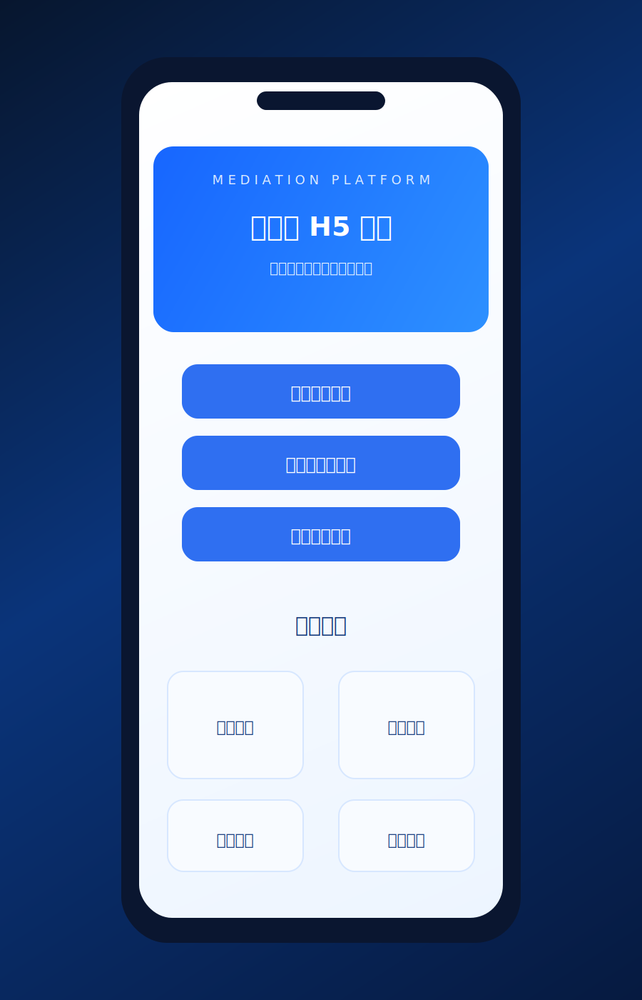

# web-test

<p align="center">
  
</p>

<p align="center">
  一个用于展示商事调解服务平台的静态前端项目，包含统一入口页、PC 端页面与移动端 H5 页面。
</p>

## 项目简介

本项目基于原生 HTML + CSS 开发，适合用作页面原型展示、静态部署预览和视觉样式迭代。整体视觉以蓝色科技感为主，围绕“数字化调解平台”设计了统一入口、桌面端平台和手机端平台三类页面。

当前覆盖的主要内容：

- 首页入口展示
- 商事调解服务品牌表达
- PC 端平台首页
- H5 移动端平台首页
- 页面之间的基础跳转

## 项目预览

### 项目 Logo


### 首页入口页



对应文件：[index.html](./index.html)

### PC 端平台页



对应文件：[platform-pc.html](./platform-pc.html)

### 移动端 H5 页



对应文件：[platform-mobile.html](./platform-mobile.html)

## 项目结构

```text
.
├─ index.html
├─ platform-pc.html
├─ platform-mobile.html
├─ styles.css
├─ README.md
└─ docs/
   └─ assets/
      ├─ logo.svg
      ├─ preview-home.svg
      ├─ preview-pc.svg
      └─ preview-mobile.svg
```

## 页面说明

### `index.html`

项目主入口页，包含服务主视觉、功能入口按钮和移动端二维码引导。

### `platform-pc.html`

PC 端平台展示页，包含导航区、核心入口卡片和平台优势模块。

### `platform-mobile.html`

移动端 H5 页面，采用手机设备框架形式展示移动入口与优势信息。

### `styles.css`

公共样式文件，负责三个页面的颜色体系、排版、布局和交互动效。

## 使用方式

### 本地预览

直接在浏览器中打开 [index.html](./index.html) 即可查看页面效果，也可以使用 VS Code 的 Live Server 等静态服务工具进行预览。

## 技术栈

- HTML5
- CSS3
- Google Fonts
- SVG 资源预览图

## 仓库地址

GitHub: <https://github.com/ZengWenJian123/web-test>

## 后续可扩展方向

- 增加真实业务数据与表单提交流程
- 补充 JavaScript 交互能力
- 接入后端接口
- 增加更多业务页面与状态流转
- 接入静态部署服务并补充在线预览地址

